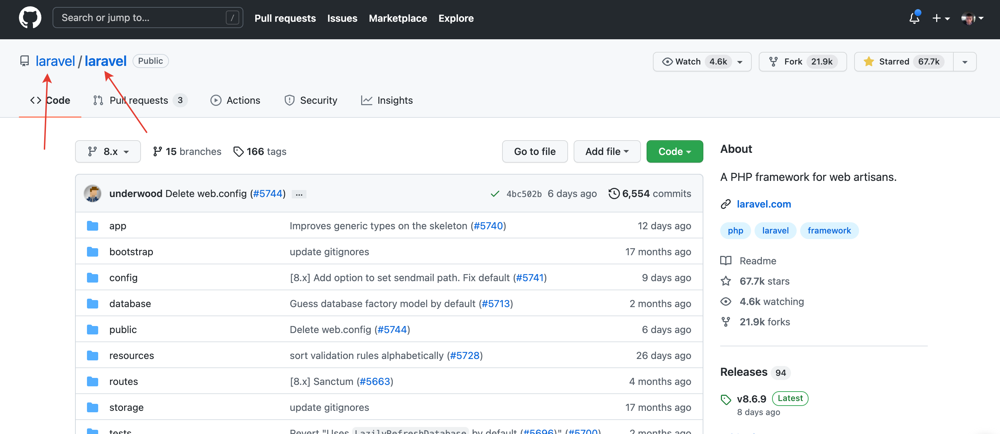

# Настройка

По-умолчанию, приложение получает проблемы репозитория [facebook/create-react-app](https://github.com/facebook/create-react-app).

Для получения данных любого другого репозитория нужно создать файл `app/.env.local` и заполнить его любыми другими значениями (автор и наименование репозитория):
```
REACT_APP_GITHUB_AUTHOR="laravel"
REACT_APP_GITHUB_REPOSITORY="laravel"
```

Узнать автора и название репозитория, можно на странице любого репозитория:



---

Следующее: [Запуск](../04-start/README.md)