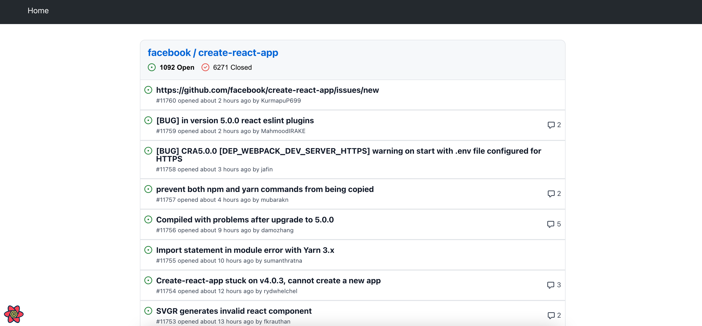

# Список проблем

При открытии приложения сразу подгружается и отображается список проблем по указанному в [настройках](../03-settings/README.md) репозиторию. По-умолчанию, первыми отображаются "открытые" (нерешенные) проблемы.

Под названием репозитория отображается общее количество открытых/закрытых проблем:

По клику на количество открытых или закрытых проблем, можно отображать в общем списке соответствующий вид проблем:

---

Следующее: [Детали по проблеме](../06-issues-details/README.md)