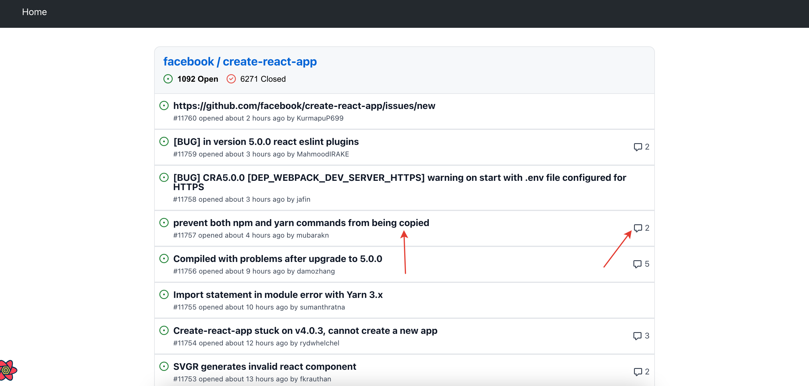
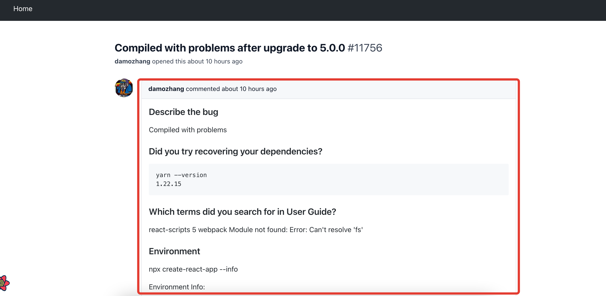
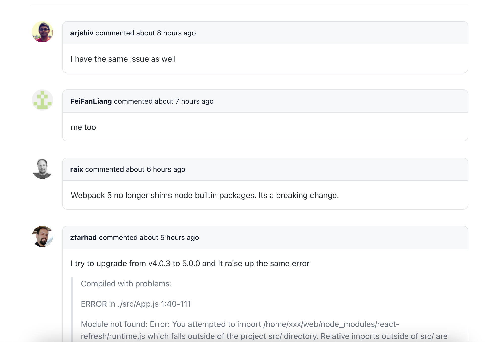

# Детали по проблеме

По клику в [списке проблем](../05-issues-list/README.md) на названии конкретной проблемы или количестве комментариев для неё:

Можно перейти на страницу деталей по этой проблеме.

Здесь отображается описание самой проблемы:

И комментарии других пользователей к ней:

